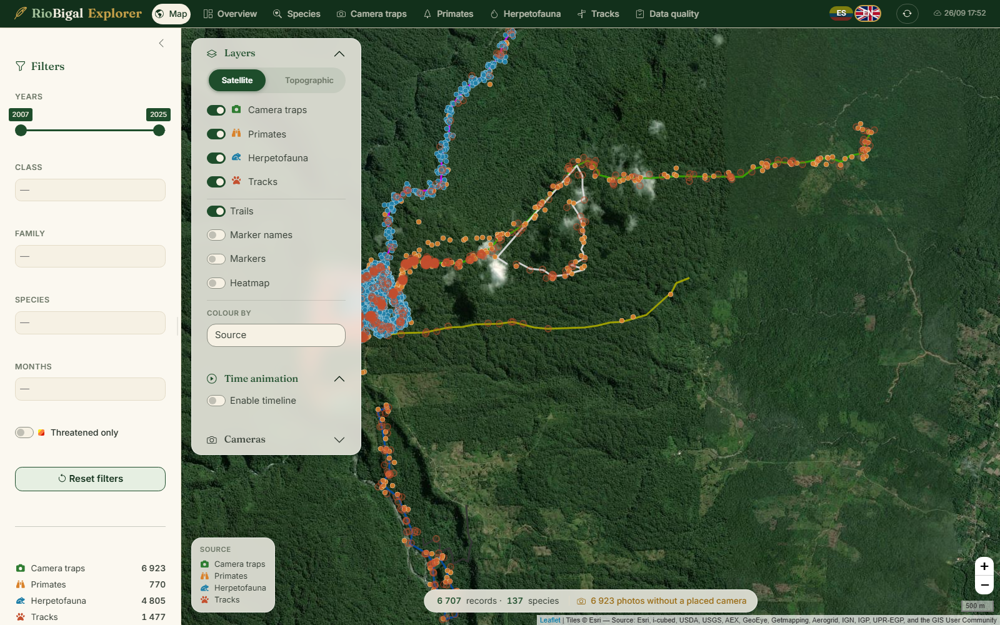
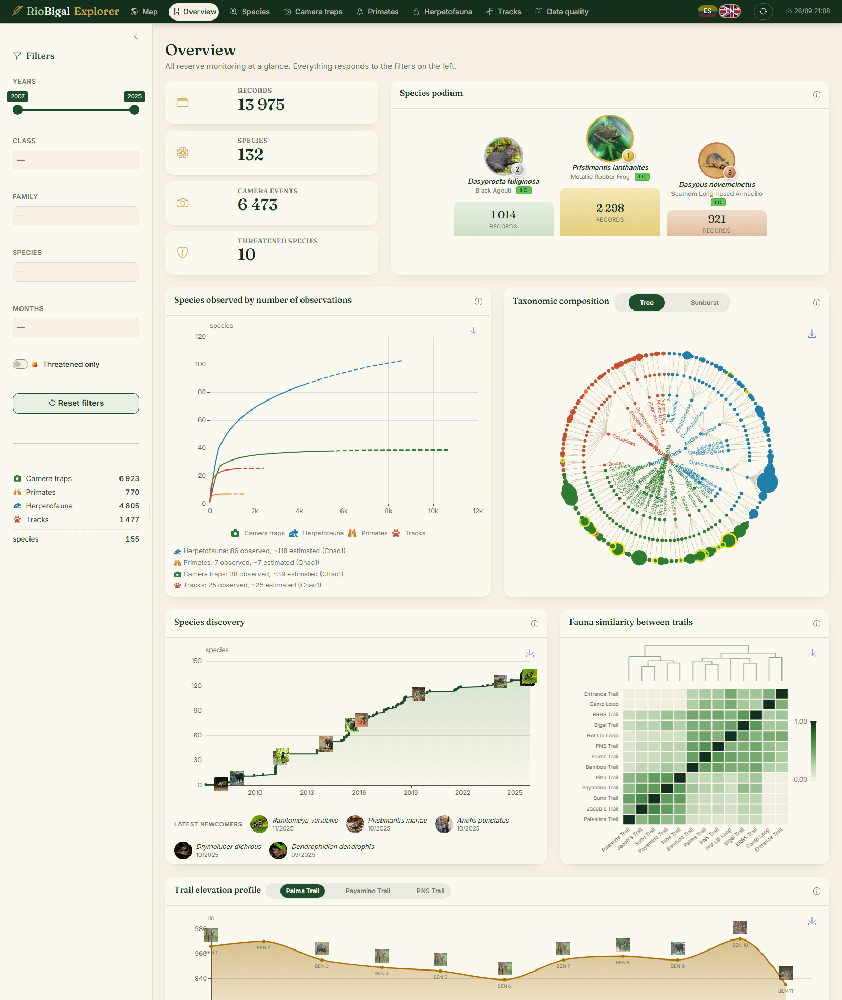
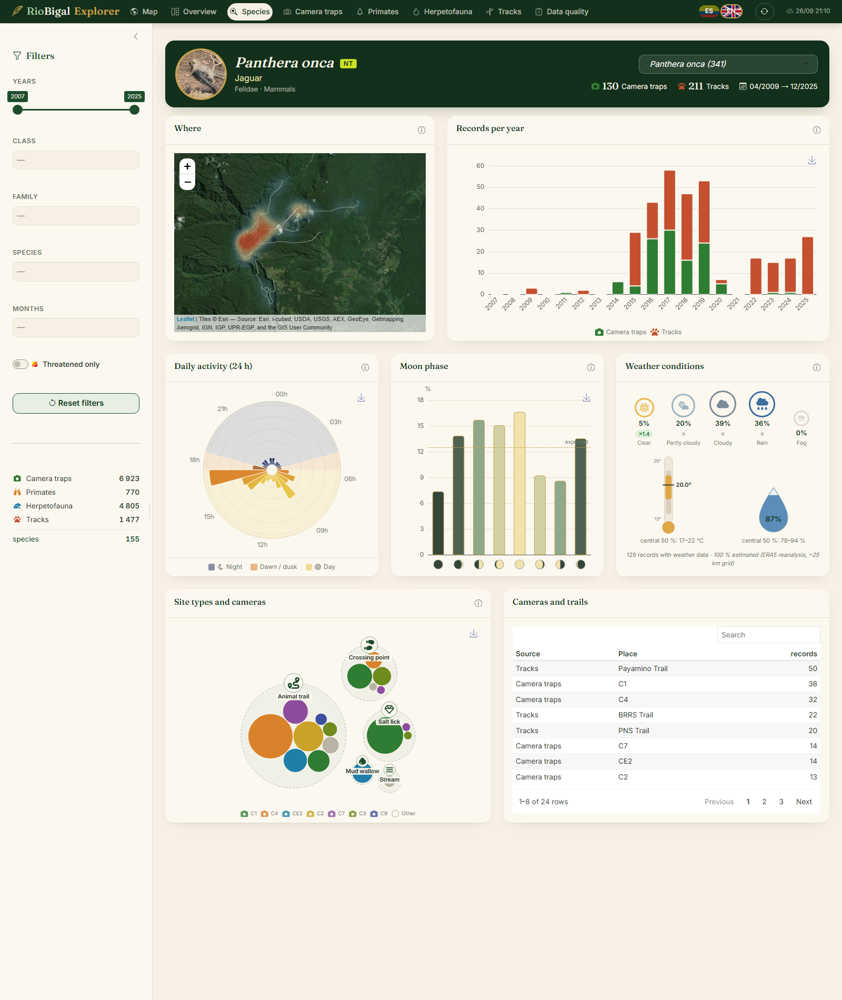
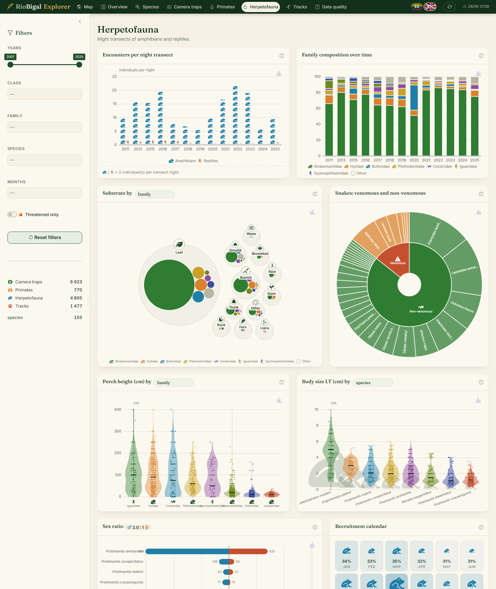

# RioBigal Explorer

An interactive, bilingual (ES/EN) dashboard to explore the wildlife monitoring data of the
**Reserva Biológica del Río Bigal** (Orellana, Ecuador). It covers camera traps, primate and
herpetofauna transects, and animal tracks. The app is built with R Shiny, bslib, leaflet and echarts.

> **Status: experimental v0.1.** It works locally on the team's data. Deployment with Google Drive sync is described below but not yet in production.



| Overview | Species profile | Herpetofauna |
|---|---|---|
|  |  |  |

## Features

**Map**
- Satellite or topographic basemap, with the trails in the colours of the reserve's official map. Balise markers and names can be shown too.
- Layers for camera photos, primates, herps and tracks. Every icon has a tooltip.
- **Colour by**: source, species, class, family, trail, moon phase, time of day, year, date or location precision.
- A density heatmap and a month-by-month timeline animation.
- **Camera placement**: users click to position each camera trap. Positions are saved for the whole team, and a bin icon resets one.

**Overview**
- Key figures, including threatened species (IUCN).
- A species podium, and a species accumulation curve with Chao1 richness estimates.
- A taxonomic tree or sunburst, and species discovery through time.
- Fauna similarity between trails (Jaccard index with a dendrogram) and trail elevation profiles.

**Species profile**
- A photo, IUCN status and a density map.
- Records per year, a 24 h activity clock and moon phases.
- A weather card (sky, temperature, humidity), and camera site types shown as bubbles.

**Camera traps**
- A relative abundance heatmap, and an activity-overlap matrix over the 10 most photographed species with a detailed pair view.
- Moon-phase activity, site preference, age structure and camera operation timeline.

**Primates**
- Encounter rates, group size (pictogram), height violins, activity and detection distance.

**Herpetofauna**
- Encounters per night (pictogram), family composition over time, and a substrate bubble-pack.
- Perch height and body size violins. Charts can be grouped by species, family or order, and clicking a group isolates it.
- Sex ratio, juvenile recruitment calendar and night-weather "sweet spot".

**Tracks**
- Species by trail, track size scatter with print icons, and seasonality.

**Data quality**
- Records the app could not interpret, with file, sheet and Excel row, so they can be fixed at the source.

## Data

The field data is **not included in this repository**. The app reads five xlsx workbooks and recognizes them by file name, so version suffixes can change:

| File name contains | Content |
|---|---|
| `global` | camera-trap photo database |
| `monos` | primate field sheets |
| `herpeto` | herpetofauna field sheets (header on row 3) |
| `tracks` / `huellas` | animal tracks |
| `balise` | GPS coordinates of trail markers |

- Column headers are matched loosely (accents, case and punctuation are ignored).
- If a file is missing a required column, the app keeps its last good version and says which column is missing.
- Camera positions placed in the app are stored in `stations.csv`, next to the xlsx files.

**Reference files** (`ref/`, committed):

| File | Content |
|---|---|
| `synonyms.csv` | misspelled → accepted species names; extend it freely |
| `taxonomy.csv` | mammal genus → family / order |
| `family_order.csv` | herp family → order |
| `balises_extra.csv` | trail markers digitized from the reserve PDF map (`tools/digitize_pdf.R`) |
| `species_media.csv` | species photo, English common name, photo credit and IUCN category. Built by `tools/fetch_species_images.R` (iNaturalist + GBIF); re-run it when new species appear. |
| `weather_hourly.csv.gz` | hourly ERA5 reanalysis weather (Open-Meteo) for camera photos, which only record temperature. Built by `tools/fetch_weather.R`. |

## Run locally

Requires R ≥ 4.4.

```r
install.packages(c("shiny", "bslib", "bsicons", "leaflet", "leaflet.extras", "echarts4r", "reactable",
                   "readxl", "dplyr", "tidyr", "sf", "iNEXT", "overlap", "lunar", "packcircles",
                   "fontawesome", "googledrive", "jsonlite"))
```

1. Put the xlsx files in a `data/` folder at the project root. It is git-ignored.
2. Run `shiny::runApp()`.
3. Add `?lang=en` to the URL for English, or `#species` to open a given page.

To run the checks: `Rscript tests/test_clean.R`.

## Deploy and team sync (Google Drive + Posit Connect Cloud)

1. Put the xlsx files in one Google Drive folder. The folder id is the last part of its URL.
2. In Google Cloud Console, enable the *Google Drive API* and create a *service account* with a JSON key.
3. Share the folder with the service account's e-mail as **Editor**. Editor access is needed to save camera positions.
4. Deploy `app.R` on [connect.posit.cloud](https://connect.posit.cloud) with these secret variables:
   - `DATA_SOURCE=drive`
   - `GDRIVE_FOLDER_ID=<folder id>`
   - `GDRIVE_SA_JSON=<content of the JSON key>`
5. The team updates the xlsx files in Drive and presses ↻ in the app. Only changed files are downloaded again.

Never commit the JSON key.

## Project structure

```
app.R            layout, global filters, server wiring
R/               data loading & cleaning, geo, i18n, icons, map and statistics modules, theme
www/             styles, JS helpers for custom charts, species photos
i18n/            ES/EN dictionary (translation.csv)
ref/             reference tables and cached enrichments (see Data)
tests/           data-layer checks
tools/           data enrichment scripts + dev helpers (screenshots, console errors, click-through test)
docs/            README screenshots
```

## Credits and licenses

- **Code:** MIT (see `LICENSE`).
- **Species photographs:** iNaturalist contributors, under their Creative Commons licenses (CC0 / BY / BY-SA / BY-NC). Each photo's credit is in `ref/species_media.csv` and shows on hover in the app.
- **IUCN Red List categories:** via [GBIF](https://www.gbif.org).
- **Weather:** ERA5 reanalysis through [Open-Meteo](https://open-meteo.com) (CC BY 4.0).
- **Basemaps:** © Esri. **Icons:** Font Awesome Free (CC BY 4.0 / MIT).
- **Field data:** © Proyecto de Conservación del Río Bigal. It is not distributed with this repository.
